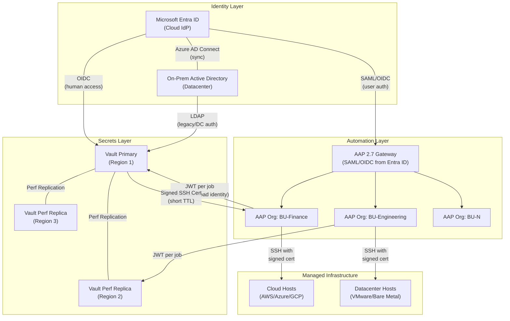
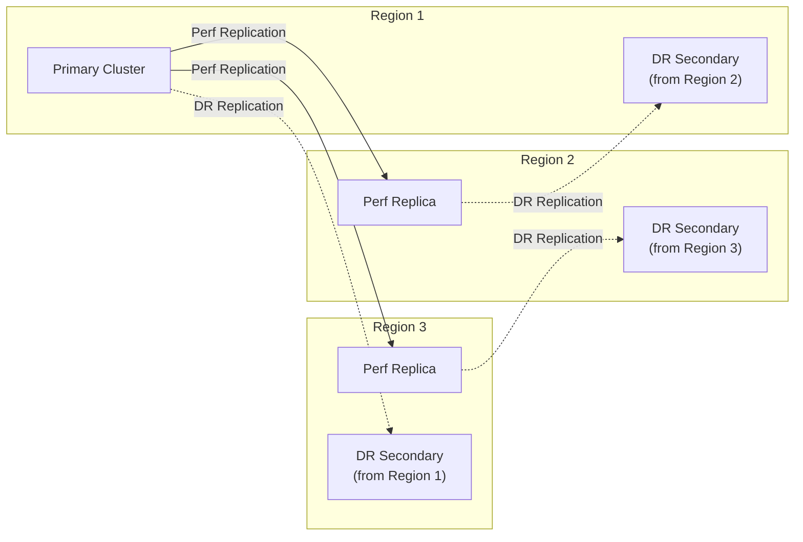
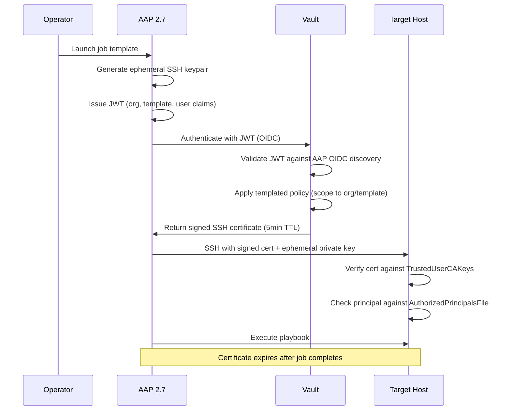

# Enterprise Zero-Trust Automation Reference Architecture

AAP 2.7 + HashiCorp Vault + Microsoft Entra ID / Active Directory

---

## Design Principles

- **Single identity authority**: Entra ID (cloud) and on-prem AD (datacenter) are the only sources of identity. A group membership change propagates access changes across the entire stack.
- **Zero standing privileges**: No static credentials stored anywhere. All secrets are ephemeral, job-scoped, and time-bound.
- **Least privilege by construction**: Vault policies are derived from AAP JWT claims -- a job can only access secrets scoped to its org, template, and environment.
- **Blast radius isolation**: Each business unit operates within its own Vault namespace and AAP organization. A compromise in one BU cannot access another's secrets.
- **Everything as code**: Vault namespaces, policies, roles, AAP orgs, teams, and job templates are all managed via Terraform and Ansible -- no manual configuration.

---

## Architecture Overview



The architecture has four layers, each with a single responsibility:

| Layer | Component | Role |
|---|---|---|
| Identity | Entra ID + On-Prem AD | Single source of truth for all user and group identity |
| Automation | AAP 2.7 | Orchestrates jobs, issues per-job JWTs via OIDC workload identity |
| Secrets | Vault Enterprise | Validates JWTs, manages secrets, signs SSH certificates |
| Infrastructure | Managed Hosts | Trust only their BU's Vault CA; no static keys |

---

## Layer 1: Identity -- Entra ID + On-Prem AD

Entra ID is the authoritative identity source for cloud and SaaS. On-prem AD handles datacenter/legacy systems. Azure AD Connect synchronizes them bidirectionally.

### Key Design Decisions

**Groups are the unit of access.** Every permission in the stack (Vault policy, AAP org/team, SSH principal) is derived from group membership -- never individual user assignments. This makes access auditable and revocable from a single point.

**Group naming convention** drives automation:

| Prefix | Consumer | Example |
|---|---|---|
| `AAP-` | AAP authenticator maps | `AAP-BU-Finance-Payments-Dev` |
| `Vault-` | Vault external identity groups | `Vault-BU-Finance-Admin` |
| `SSH-` | Vault SSH role principals | `SSH-Prod-Deploy` |

**Entra ID groups claim** is configured in both the AAP app registration and the Vault app registration. Vault must set `provider_config.provider = "azure"` to handle the groups overage problem (Azure limits inline group claims to 200; with the azure provider, Vault automatically calls the Microsoft Graph API for the full list).

**On-prem AD** is consumed by Vault via LDAP auth with the `1.2.840.113556.1.4.1941` matching rule OID for nested group resolution. This is critical for environments where datacenter hosts must be managed without cloud dependency.

See: [examples/vault/ldap-auth-ad.sh](examples/vault/ldap-auth-ad.sh), [examples/vault/oidc-auth-entra-id.sh](examples/vault/oidc-auth-entra-id.sh)

### Trust Chain

```
Entra ID / AD group membership
  --> AAP org + team assignment (via authenticator maps)
  --> Vault policy binding (via external identity groups)
  --> SSH principal authorization (via Vault SSH role)
  --> Host access (via TrustedUserCAKeys + AuthorizedPrincipalsFile)
```

A single group removal in Entra ID cascades to revoke automation access, secrets access, and SSH access. No manual intervention required at any layer.

---

## Layer 2: Vault Enterprise -- Federated Secrets and SSH CA

### Cluster Topology

Each region has a Vault cluster. The primary is in Region 1; Regions 2 and 3 run performance replicas. Each cluster has a DR secondary cross-located in a different region for region-failure resilience.



| Replication Mode | Purpose | Serves Client Traffic | Replicates Tokens/Leases |
|---|---|---|---|
| Performance | Regional read scaling, reduced JWT validation latency | Yes | No (local per cluster) |
| Disaster Recovery | Hot standby for region failure | No (until promoted) | Yes (seamless promotion) |

Regional AAP instances should target their local performance replica to minimize latency on JWT validation and SSH cert signing. Writes (policy changes, secret updates) transparently forward to the primary.

### Namespace Hierarchy

```
root/
  auth/oidc              Entra ID (human access, cloud users)
  auth/ldap              On-prem AD (datacenter users)
  auth/jwt               AAP OIDC workload identity (all BUs)
  transit/               Shared encryption-as-a-service

  bu-finance/
    ssh-ca/              SSH CA for finance hosts
    kv/                  Finance secrets (KV v2)
    database/            Finance DB dynamic credentials
    team-payments/       Child namespace for self-service
    team-risk/

  bu-engineering/
    ssh-ca/
    kv/
    database/
    team-platform/
    team-app-dev/

  bu-operations/
    ssh-ca/
    kv/
```

Auth methods (OIDC, LDAP, JWT) live in the root namespace -- users and workloads authenticate once. Cross-namespace access is handled via Vault Identity Groups: external groups in root map to internal groups in each BU namespace with namespace-scoped policies. No auth method duplication per namespace.

See: [examples/vault/namespace-setup.sh](examples/vault/namespace-setup.sh), [examples/terraform/vault-namespaces/main.tf](examples/terraform/vault-namespaces/main.tf)

### SSH CA Trust Domains

Each BU namespace gets its own SSH secrets engine mount with its own CA keypair. This provides cryptographic isolation: a certificate signed by `bu-finance/ssh-ca` is rejected by a host that only trusts `bu-engineering/ssh-ca`.

```
bu-finance/ssh-ca/
  config/ca                CA keypair (private key never leaves Vault)
  roles/automation         TTL: 5m, principals: deploy, default_user: deploy
  roles/interactive        TTL: 30m, principals: admin (MFA required upstream)

bu-engineering/ssh-ca/
  config/ca                Separate CA keypair
  roles/automation         TTL: 5m, principals: deploy
  roles/developer          TTL: 1h, principals: dev-user
```

Host-side configuration per trust domain:

```
# /etc/ssh/sshd_config on a finance host
TrustedUserCAKeys /etc/ssh/vault-finance-ca.pub
AuthorizedPrincipalsFile /etc/ssh/auth_principals/%u
```

The `AuthorizedPrincipalsFile` adds a second layer: even with a valid certificate, the embedded principal must match one listed in the host's principals file for the target user. This prevents lateral movement between roles.

See: [examples/vault/ssh-ca-setup.sh](examples/vault/ssh-ca-setup.sh), [examples/hosts/sshd_config.example](examples/hosts/sshd_config.example)

### Templated Policies (Key Scalability Mechanism)

Instead of writing one policy per org/team/template combination (which creates N*M*O policies), use Vault's templated policies with AAP JWT claim mappings. A single policy handles all business units:

```hcl
# Automatically scopes secret access to the job's org and template
path "{{identity.entity.aliases.AUTH_JWT_ACCESSOR.metadata.org}}/kv/data/{{identity.entity.aliases.AUTH_JWT_ACCESSOR.metadata.job_template}}/*" {
  capabilities = ["read"]
}

path "{{identity.entity.aliases.AUTH_JWT_ACCESSOR.metadata.org}}/ssh-ca/sign/automation" {
  capabilities = ["create", "update"]
}
```

The corresponding JWT role maps AAP claims to Vault identity metadata:

```json
{
  "role_type": "jwt",
  "bound_audiences": ["https://vault.example.com:8200"],
  "user_claim": "sub",
  "bound_claims": {
    "aap_controller_organization_name": ["BU-Finance", "BU-Engineering", "BU-Operations"]
  },
  "claim_mappings": {
    "aap_controller_organization_name": "org",
    "aap_controller_job_template_name": "job_template"
  },
  "policies": ["aap-workload-policy"]
}
```

**Result**: A `Patch-Servers` job in `BU-Finance` can only read `bu-finance/kv/data/Patch-Servers/*` and sign SSH certs via `bu-finance/ssh-ca/sign/automation`. No additional Vault configuration is needed when new orgs or templates are added -- the policy template handles it automatically.

**Onboarding a new BU** requires only adding its name to the JWT role's `bound_claims` list and creating its namespace. The templated policy, SSH CA, and KV mounts follow the naming convention.

See: [examples/vault/aap-workload-policy.hcl](examples/vault/aap-workload-policy.hcl), [examples/vault/jwt-role-aap.json](examples/vault/jwt-role-aap.json)

### Available JWT Claims from AAP 2.7

These claims are embedded in every JWT issued by AAP's OIDC workload identity:

| Claim | Use in Vault Policy | Example Value |
|---|---|---|
| `aap_controller_organization_name` | Namespace scoping | `BU-Finance` |
| `aap_controller_job_template_name` | Secret path scoping | `Patch-Servers` |
| `aap_controller_playbook_name` | Audit / fine-grained binding | `playbooks/patch.yml` |
| `aap_controller_launched_by_name` | Audit trail | `jsmith` |
| `aap_controller_launch_type` | Policy (e.g., deny manual for prod) | `scheduled` |
| `aap_controller_inventory_name` | Environment scoping | `Finance-Prod` |
| `sub` | Unique workload identifier | `workload_type:aap_controller_automation_job:...` |

---

## Layer 3: AAP 2.7 -- Multi-Org Automation Platform

### Organization Structure

```
AAP Gateway (single entry point, all API access)
  |
  +-- Org: BU-Finance
  |     Teams: Payments-Dev, Risk-Ops, Finance-Admin
  |     Credentials: Vault SSH OIDC (bound to bu-finance namespace)
  |     Inventories: Finance-Prod, Finance-Staging
  |     Projects: finance-automation (Git)
  |
  +-- Org: BU-Engineering
  |     Teams: Platform, App-Dev, SRE
  |     Credentials: Vault SSH OIDC (bound to bu-engineering namespace)
  |     Inventories: Eng-Prod, Eng-Dev
  |     Projects: eng-automation (Git)
  |
  +-- Org: Shared-Services
        Projects: Common playbooks, compliance roles, patching
        (Read-only access granted to all other orgs)
```

AAP 2.7's platform gateway is the single entry point for all interactions. Direct API access to the automation controller is removed. This centralizes authentication and RBAC enforcement.

### Entra ID to AAP Mapping (Authenticator Maps)

AAP 2.7 authenticator maps auto-provision users into the correct org and team based on Entra ID group membership:

| Entra ID Group | AAP Organization | AAP Team | AAP Role |
|---|---|---|---|
| `AAP-BU-Finance-Payments-Dev` | BU-Finance | Payments-Dev | Job Template Execute |
| `AAP-BU-Finance-Admin` | BU-Finance | Finance-Admin | Organization Admin |
| `AAP-BU-Engineering-SRE` | BU-Engineering | SRE | Job Template Execute |
| `AAP-Platform-Admin` | (all) | (superuser) | System Administrator |

When a user is removed from an Entra ID group, their next AAP login strips the corresponding team/org membership. Combined with short-lived Vault tokens and SSH certs, access revocation is near-instantaneous -- no credentials to manually rotate.

See: [examples/aap/configure-multi-org.yml](examples/aap/configure-multi-org.yml), [examples/aap/authenticator-maps.yml](examples/aap/authenticator-maps.yml)

### Per-Org Vault OIDC Credential

Each AAP organization has its own "HashiCorp Vault Signed SSH (OIDC)" credential configured with:

| Field | Value (example for BU-Finance) |
|---|---|
| Server URL | `https://vault.example.com:8200` |
| JWT Role | `aap-workload-role` |
| Namespace | `bu-finance` (Vault Enterprise) |
| Path to Auth | `jwt` |

The JWT issued by AAP automatically includes `aap_controller_organization_name: BU-Finance`, so Vault's templated policy scopes the credential to the `bu-finance` namespace. A single JWT role serves all organizations.

---

## Layer 4: Managed Infrastructure -- Host Trust Model

### Host Bootstrap

When a host is provisioned (via AAP, Terraform, or cloud-init), it receives:

1. The Vault CA public key for its trust domain (BU-specific)
2. An `AuthorizedPrincipalsFile` defining which principals can log in as which local users
3. No SSH keys, no passwords -- the host trusts only certificates signed by its BU's Vault CA

See: [examples/hosts/bootstrap-host.yml](examples/hosts/bootstrap-host.yml)

### Certificate Lifecycle



At no point does a long-lived credential exist. The SSH keypair is generated per-job, the JWT expires with the job timeout, and the signed certificate has a 5-minute TTL. After the job completes, all three artifacts are worthless.

### On-Prem / Datacenter Variant

For hosts in traditional datacenters where Entra ID is unavailable:

- Vault LDAP auth against on-prem AD provides human access to Vault for operators
- AAP OIDC workload identity still works (JWT is issued by AAP, validated by Vault -- no dependency on Entra ID for machine-to-machine auth)
- Hosts trust the same BU-specific Vault CA public key
- AD group membership (synced to Entra ID via Azure AD Connect) determines which Vault policies apply

The key insight: workload identity (AAP to Vault) does not depend on Entra ID. AAP is its own OIDC provider. The Entra ID dependency is only for human authentication to AAP and Vault.

---

## Security Properties

| Property | How It Is Achieved |
|---|---|
| **No static credentials** | AAP stores no Vault tokens or SSH keys; JWTs and certs are ephemeral |
| **Credential scoping** | Templated Vault policies ensure a job can only access its own org/template secrets |
| **Blast radius isolation** | Vault namespaces and separate SSH CAs per BU prevent cross-BU access |
| **Automated revocation** | Short TTLs (5min SSH certs, 5min JWTs) mean credentials self-expire; no CRL/OCSP needed |
| **Identity-driven access** | Entra ID group membership is the single source of truth for all access decisions |
| **Audit trail** | Vault audit logs capture every secret access and cert signing with the full JWT claims |
| **Defense in depth** | Even with a valid cert, `AuthorizedPrincipalsFile` on the host restricts which users the cert can assume |
| **No trust-on-first-use** | Hosts trust a CA, not individual keys; TOFU is eliminated for both user and host verification |

---

## Operational Model

### Infrastructure as Code

| Component | Tool | Source of Truth |
|---|---|---|
| Vault clusters + replication | Terraform (vault provider) | Git repo |
| Vault namespaces, policies, auth config | Terraform (vault provider) | Git repo |
| AAP orgs, teams, credentials, templates | Ansible (`ansible.platform` + `ansible.controller`) | Git repo |
| Host provisioning + CA trust | Ansible (via AAP job templates) | Git repo |
| Entra ID app registrations + groups | Terraform (azuread provider) | Git repo |

See: [examples/terraform/](examples/terraform/)

### Day-2 Operations

**Onboarding a new BU:**

1. Create Vault namespace + SSH CA mount + KV mount (Terraform)
2. Create AAP organization + Vault OIDC credential (Ansible)
3. Create Entra ID groups with naming convention (Terraform)
4. Add BU name to JWT role `bound_claims` list (Terraform)
5. The templated policy handles secret scoping automatically

**Rotating an SSH CA:**

1. Generate new CA keypair in the BU's SSH mount
2. Distribute the new CA public key to all BU hosts (keep old key trusted during transition)
3. After transition period, remove the old CA public key from hosts
4. Blast radius is limited to one BU's hosts

**Revoking a user:**

1. Remove user from Entra ID groups
2. Next AAP login strips team/org membership (authenticator maps)
3. Existing JWTs and SSH certs expire within minutes
4. No manual credential rotation at any layer

**Auditing access:**

Query Vault audit logs by JWT claim fields:
- "Which jobs in BU-Finance accessed production secrets last week?"
- "Which users launched manual (non-scheduled) jobs against production?"
- "How many SSH certificates were signed for the `admin` principal?"

---

## Comparison with Demo Implementation

This reference architecture extends the working demo in this repo:

| Aspect | Demo (this repo) | Enterprise Reference Architecture |
|---|---|---|
| Vault deployment | Dev mode, single pod | HA clusters with performance + DR replication |
| Vault auth | Single JWT role, root token | JWT + OIDC (Entra ID) + LDAP (on-prem AD) |
| Vault isolation | Single namespace | Namespace per BU with separate SSH CAs |
| Vault policies | Static policy for one SSH role | Templated policies using JWT claim mappings |
| AAP structure | Default org, single credential | Org per BU, per-org OIDC credentials |
| Identity source | Local AAP admin | Entra ID + AD with group-driven access |
| Host trust | Single CA, one host | Per-BU CAs with AuthorizedPrincipalsFile |
| IaC | Ansible playbooks | Terraform (Vault/Entra ID) + Ansible (AAP/hosts) |

The demo proves the core OIDC flow end-to-end. The enterprise architecture adds multi-tenancy, federation, and identity integration around the same fundamental trust model.
